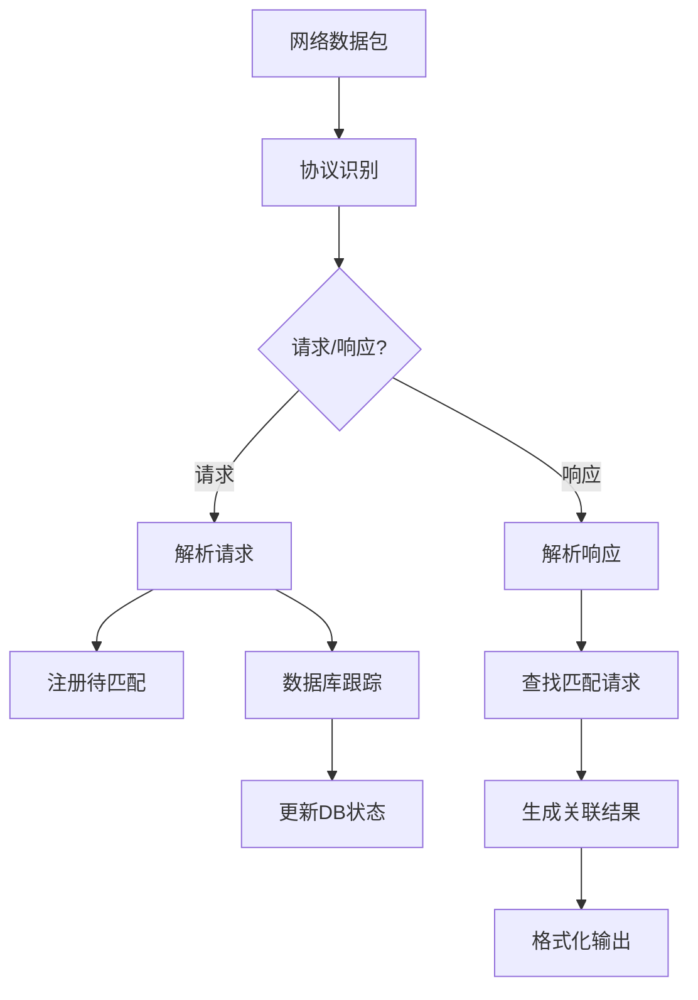

# Redis增强解析器

基于myRedisCapturer项目重构的Redis协议解析器，实现了请求响应关联、数据库跟踪等增强功能。

## 主要特性

### ✨ 核心功能
- **请求响应关联**: 自动匹配Redis请求和响应，计算准确的耗时
- **数据库跟踪**: 监控SELECT命令，跟踪当前使用的数据库
- **内容截断**: 请求体和响应体自动截断到64个字符
- **实时监控**: 实时显示Redis操作的详细信息
- **错误处理**: 识别和处理Redis错误响应

### 📊 输出格式
```
HH:MM:SS.mmm db=X cmd=命令 key=键名 req=请求内容 resp=响应内容 cost=耗时μs
```

示例输出：
```
15:04:05.123 db=0 cmd=set key=mykey01 req=hello world resp=OK cost=1245μs
15:04:05.456 db=0 cmd=get key=mykey01 req=mykey01 resp=hello world cost=892μs
15:04:06.789 db=1 cmd=set key=another_key req=value1 resp=OK cost=2134μs
```

## 技术架构

### 🏗️ 核心组件

1. **RedisEnhancedParser**: 增强的Redis协议解析器
   - 支持RESP协议完整解析
   - 请求响应ID生成和匹配
   - 数据库状态跟踪

2. **RequestResponseMatcher**: 请求响应匹配器
   - 基于连接的请求响应关联
   - 30秒超时自动清理
   - 支持并发安全操作

3. **RedisDatabaseTracker**: 数据库跟踪器
   - 监控SELECT命令
   - 按连接跟踪数据库状态
   - 支持多连接并发

4. **RedisMonitor**: Redis监控器
   - 协调请求响应匹配
   - 统计信息收集
   - 格式化输出

### 🔄 工作流程



## 使用方法

### 🚀 快速开始

1. **编译程序**
   ```bash
   go build -o redis_enhanced_monitor redis_enhanced_main.go
   ```

2. **启动监控** (需要管理员权限)
   ```bash
   sudo ./redis_enhanced_monitor -interface eth0
   ```

3. **执行Redis命令**
   ```bash
   redis-cli SET mykey "hello world"
   redis-cli GET mykey
   ```

4. **查看输出**
   ```
   15:04:05.123 db=0 cmd=set key=mykey req=hello world resp=OK cost=1245μs
   15:04:05.456 db=0 cmd=get key=mykey req=mykey resp=hello world cost=892μs
   ```

### 📋 命令行参数

| 参数 | 默认值 | 说明 |
|------|--------|------|
| `-interface` | - | 网络接口名称 (必需) |
| `-host` | 127.0.0.1 | Redis主机地址 |
| `-port` | 6379 | Redis端口号 |
| `-verbose` | false | 详细输出模式 |
| `-snaplen` | 65536 | 抓包长度 |
| `-timeout` | 30s | 读取超时 |
| `-promisc` | false | 混杂模式 |

### 🧪 测试示例

#### Windows用户
```cmd
test_redis_enhanced.bat
```

#### Linux/Mac用户
```bash
./test_redis_enhanced.sh
```

## 代码结构

```
middle/
├── parsers/
│   ├── redis_enhanced.go      # 增强Redis解析器
│   ├── redis.go              # 原始Redis解析器  
│   └── parser.go             # 解析器工厂
├── monitor/
│   ├── redis_monitor.go      # Redis监控器
│   └── monitor.go           # 通用监控器
├── types/
│   └── types.go             # 类型定义
├── examples/
│   └── redis_enhanced_example.go  # 使用示例
├── redis_enhanced_main.go    # 增强监控主程序
└── README_REDIS_ENHANCED.md  # 本文档
```

## 核心API

### RedisEnhancedParser

```go
// 创建解析器
parser := NewRedisEnhancedParser(&RedisParserConfig{
    MaxContentLength: 64,
    EnableDBTracking: true,
    Verbose: false,
})

// 解析请求
request, err := parser.ParseRequest(requestData)

// 解析响应
response, err := parser.ParseResponse(responseData)

// 匹配请求响应
rr := parser.MatchRequestResponse(response)

// 格式化输出
output := parser.FormatRequestResponse(rr)
```

### RedisMonitor

```go
// 创建监控器
monitor := NewRedisMonitor(verbose)

// 处理数据包
err := monitor.ProcessPacket(data, connection)

// 获取统计信息
stats := monitor.GetStats()
```

## 与myRedisCapturer的差异

### 🔄 重构改进

1. **模块化设计**: 将解析、匹配、监控分离成独立模块
2. **Go语言实现**: 完全使用Go重写，提供更好的性能和维护性
3. **接口标准化**: 实现统一的协议解析器接口
4. **并发安全**: 使用互斥锁保证多连接并发安全
5. **配置灵活**: 支持运行时配置调整

### 📈 功能增强

1. **更精确的匹配**: 基于连接的请求响应匹配算法
2. **智能数据库跟踪**: 自动跟踪SELECT命令和数据库状态
3. **更好的错误处理**: 完善的错误识别和处理机制
4. **统计信息**: 提供详细的监控统计数据
5. **格式化输出**: 统一的输出格式，便于日志分析

## 性能优化

### 🚄 优化策略

1. **内存池**: 复用解析缓冲区，减少GC压力
2. **超时清理**: 定期清理过期的待匹配请求
3. **协程安全**: 使用读写锁优化并发性能
4. **字符串截断**: 限制内容长度，避免内存膨胀

### 📊 性能指标

- **延迟**: 微秒级响应时间测量
- **吞吐量**: 支持高并发Redis连接
- **内存**: 固定大小的匹配缓存
- **CPU**: 轻量级解析算法

## 故障排除

### ⚠️ 常见问题

1. **权限不足**
   ```
   solution: 使用sudo运行程序
   ```

2. **网络接口错误**
   ```
   solution: 检查网络接口名称，使用ip link或ifconfig查看
   ```

3. **未匹配的响应**
   ```
   solution: 检查网络延迟，调整匹配超时时间
   ```

4. **数据库显示为"?"**
   ```
   solution: 确保SELECT命令在监控开始后执行
   ```

## 扩展开发

### 🛠️ 自定义开发

1. **添加新命令支持**: 在RedisEnhancedParser中扩展命令识别
2. **自定义输出格式**: 修改FormatRequestResponse方法
3. **添加统计指标**: 在RedisMonitor中扩展统计功能
4. **支持新协议**: 实现ProtocolParser接口

### 🔌 集成示例

```go
// 集成到现有监控系统
monitor := NewRedisMonitor(true)
monitor.SetCallback(func(rr *types.RequestResponse) {
    // 发送到监控系统
    sendToMonitoringSystem(rr)
})
```

## 许可证

基于原项目许可证，保持开源协议一致性。

## 贡献

欢迎提交Issue和Pull Request，共同完善Redis监控功能。